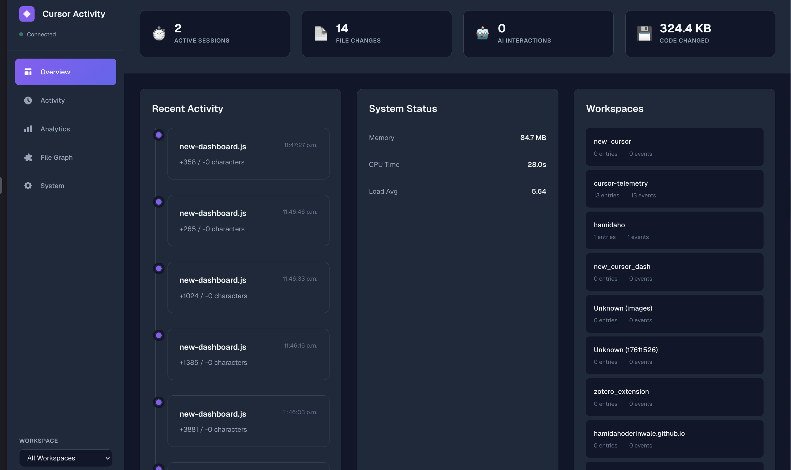
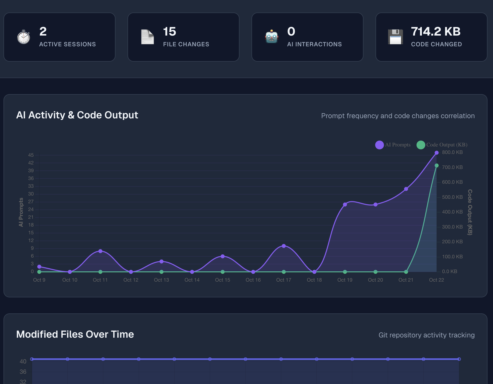

# Cursor Telemetry Dashboard

A comprehensive real-time monitoring and analytics platform for Cursor IDE. Captures file changes, AI prompts, code modifications, and system metrics with advanced analytics for context usage, productivity insights, error tracking, and file relationships. Features a live web dashboard with multi-layer search, 50+ API endpoints, and SQLite-backed persistence.

## Overview

The Cursor Telemetry Dashboard is an intelligent monitoring platform that captures and analyzes your complete development workflow in Cursor IDE. It automatically tracks file changes, mines AI prompts from Cursor's internal database, monitors system resources, and provides actionable insights through advanced analytics engines. All data is persisted in SQLite with a real-time web dashboard and comprehensive REST API.

### Key Features

- **Real-Time Monitoring**: Track file changes, AI prompts, and system metrics live
- **Cursor DB Mining**: Extract AI conversations directly from Cursor's internal database
- **Advanced Analytics**: Context window usage, error tracking, productivity insights
- **Multi-Layer Search**: Full-text (Lunr.js) + Semantic (TF-IDF) + Fuzzy matching
- **File Relationships**: Co-change patterns, dependency graphs, hotspot detection
- **SQLite Persistence**: Durable storage with 13 indexes and foreign key constraints
- **Comprehensive API**: 50+ REST endpoints + WebSocket real-time updates
- **Export Capability**: Download complete database snapshots as JSON
- **Interactive Dashboard**: 7 views with Chart.js and D3.js visualizations

### Intelligent Activity Linking

Unlike simple logging systems, Cursor Telemetry creates a rich, interconnected graph of development activity through:

- **Automatic Linking**: File changes are linked to AI prompts within a 5-minute window, creating bidirectional relationships
- **Session Chunking**: Events are grouped into work sessions with 30-minute inactivity timeout
- **Multi-Workspace Support**: Independent session tracking per project for parallel development
- **Conversation Threading**: Composer interactions tracked as threads with iterations and related file changes
- **Terminal Integration**: Shell commands linked to file changes, errors, and workspace context
- **Contextual Relationships**: Screenshots, git commits, and errors associated via time-based proximity

This enables analytics like time-to-implementation, prompt iteration detection, error pattern analysis, and complete context for each code change.

## Dashboard Preview

### Overview Page
The Overview page provides real-time statistics and activity monitoring at a glance.



**Features shown:**
- Active sessions and file change counters
- AI interactions and code changed metrics
- Recent activity timeline with file modifications
- System status (memory, CPU, load average)
- Workspace list with entry and event counts

### Analytics Page
The Analytics page displays comprehensive insights into AI activity, code output, and productivity metrics.



**Features shown:**
- AI Activity & Code Output correlation graph
- Prompt frequency tracking over time
- Code output volume (KB) visualization
- Modified files over time tracking
- Git repository activity monitoring

## System Architecture

```
┌─────────────────────────────────────────────────────────────────────┐
│                    Cursor Telemetry Dashboard                       │
├─────────────────────────────────────────────────────────────────────┤
│  Frontend Dashboard (Vanilla JS)                                   │
│  ├── Real-time Visualizations (Chart.js, D3.js)                   │
│  ├── Multi-layer Search Engine (Lunr.js + TF-IDF Semantic)        │
│  ├── Activity Timeline & File Graph Views                          │
│  ├── Enhanced Analytics Dashboard (Context, Errors, Productivity)  │
│  ├── API Documentation View                                        │
│  ├── Status Popup (Console Monitoring)                             │
│  └── Export JSON (Database Snapshots)                              │
├─────────────────────────────────────────────────────────────────────┤
│  Companion Service (Port 43917) - Node.js/Express                  │
│  ├── HTTP REST API (50+ endpoints)                                │
│  │   ├── Core: /api/activity, /entries, /health                   │
│  │   ├── Database: /api/database/stats, /api/export/database     │
│  │   ├── Analytics: /api/analytics/context, errors, productivity  │
│  │   └── Raw Data: /ide-state, /raw-data/system-resources        │
│  ├── WebSocket Server (Socket.IO for real-time updates)           │
│  ├── SQLite Database (companion.db)                               │
│  │   ├── entries: File changes with before/after code             │
│  │   ├── prompts: AI interactions with rich metadata              │
│  │   └── events: Activity timeline                                │
│  ├── Cursor Database Mining                                        │
│  │   ├── Parser: Extracts from state.vscdb every 10s             │
│  │   ├── Metadata: Lines added/removed, context usage, AI mode   │
│  │   └── Linking: Auto-links prompts to code changes (5min window)│
│  ├── Analytics Engines                                             │
│  │   ├── Context Analyzer: @ mentions, token estimation           │
│  │   ├── Error Tracker: Linter, tests, terminal errors            │
│  │   └── Productivity Tracker: Time-to-edit, iterations, churn   │
│  ├── Data Capture Systems                                          │
│  │   ├── File Watcher (Chokidar): Monitors workspace changes      │
│  │   ├── Terminal Monitor: Shell history, process monitoring      │
│  │   ├── Clipboard Monitor: Captures prompts from clipboard       │
│  │   ├── AppleScript: IDE state capture (macOS)                   │
│  │   ├── Git Monitor: Commits, branches, activity                 │
│  │   └── System Resources: CPU, memory, load metrics              │
│  └── Integration Points                                            │
│      ├── MCP Server: Model Context Protocol endpoints             │
│      └── Screenshot Monitor: Browser screenshot tracking          │
├─────────────────────────────────────────────────────────────────────┤
│  Data Storage Layer                                                │
│  ├── SQLite Database (companion.db) - Primary storage             │
│  │   ├── Size: ~121MB (typical), 5-10MB/hour growth              │
│  │   ├── Foreign Keys: Enabled for referential integrity          │
│  │   ├── Indexes: 13 indexes for query optimization               │
│  │   └── Validation: Integrity checks, orphan detection           │
│  ├── In-Memory Cache (db object)                                  │
│  │   ├── Fast access for real-time operations                     │
│  │   └── Synchronized with SQLite                                 │
│  └── IndexedDB (Browser - Optional)                               │
│      └── Persistent caching for dashboard offline capability      │
├─────────────────────────────────────────────────────────────────────┤
│  Search & Discovery Engine                                         │
│  ├── Full-Text Search (Lunr.js)                                   │
│  │   ├── Inverted index for fast lookups                          │
│  │   └── Supports advanced queries (type:, date:, workspace:)     │
│  ├── Semantic Search (TF-IDF + Cosine Similarity)                 │
│  │   ├── Document vectorization                                   │
│  │   ├── Context-aware matching                                   │
│  │   └── Auto-activates when full-text scores low                 │
│  ├── Fuzzy Search (Levenshtein Distance)                          │
│  │   ├── Typo tolerance                                           │
│  │   └── Fallback for edge cases                                  │
│  └── Advanced Features                                             │
│      ├── Search history & suggestions                             │
│      ├── Result ranking & scoring                                 │
│      └── Filter support (workspace, type, date range)             │
└─────────────────────────────────────────────────────────────────────┘
```

### Data Flow

1. **Activity Capture** (Multiple Sources)
   - **File System**: Chokidar monitors workspace → detects changes → calculates diffs
   - **Cursor Database**: Parser queries state.vscdb every 10s → extracts prompts with metadata
   - **Clipboard**: Monitors every 10s → captures potential prompts
   - **System**: AppleScript captures IDE state every 2s → Git/system metrics collected
   - **Screenshots**: Watches browser screenshot directory for web dev captures

2. **Data Processing & Enrichment**
   - **Prompt Enhancement**: Extract @ mentions, estimate tokens, analyze context usage
   - **Code Analysis**: Calculate before/after diffs, detect patterns, extract metadata
   - **Linking Logic**: Match prompts to code changes within 5-minute window
   - **Analytics Computation**: Context metrics, error detection, productivity tracking

3. **Persistent Storage** (Dual-layer)
   - **In-Memory DB**: Fast access for real-time operations
   - **SQLite DB**: Durable storage with automatic persistence
   - **Synchronization**: Write-through cache pattern ensures consistency

4. **API Serving** (50+ Endpoints)
   - **REST API**: HTTP endpoints for all data access
   - **WebSocket**: Real-time push notifications via Socket.IO
   - **Static Serving**: Dashboard HTML/CSS/JS from Express

5. **Dashboard Rendering**
   - **Data Fetch**: HTTP polling every 5s + WebSocket updates
   - **Search Indexing**: Builds Lunr index + TF-IDF vectors on data load
   - **Visualization**: Chart.js for metrics, D3.js for graphs
   - **State Management**: Global state object with view routing

6. **Search & Discovery**
   - **Query Parsing**: Extract filters and search terms
   - **Multi-method Search**: Lunr → Semantic → Fuzzy (cascading)
   - **Result Aggregation**: Merge results, rank by score + recency
   - **Real-time Updates**: Re-index on data refresh

## Tech Stack

### Frontend (Vanilla JavaScript)
- **Chart.js**: Time-series and metric visualizations
- **D3.js**: Interactive graphs and network visualizations
- **Lunr.js**: Full-text search indexing
- **Socket.IO Client**: Real-time WebSocket communication
- **HTML5/CSS3**: Modern responsive UI with CSS variables
- **IndexedDB**: Optional client-side persistent caching

### Backend (Node.js Companion Service)
- **Express.js**: HTTP server and REST API framework
- **Socket.IO**: Real-time bidirectional WebSocket communication
- **SQLite3**: Primary relational database (`companion.db`)
  - 3 core tables (entries, prompts, events)
  - 13 performance indexes
  - Foreign key constraints enabled
- **Chokidar**: File system monitoring with diff detection
- **Clipboardy**: Cross-platform clipboard access

### Data Mining & Analytics
- **Cursor Database Parser**: Direct SQLite extraction from `state.vscdb`
- **Context Analyzer**: @ mention extraction, token estimation, file co-occurrence
- **Error Tracker**: Linter/test/terminal error aggregation
- **Productivity Tracker**: Time-to-edit, iteration detection, code churn analysis
- **Semantic Search**: TF-IDF vectorization with cosine similarity

### System Integration
- **AppleScript**: macOS IDE state capture (windows, files, cursor position)
- **MCP (Model Context Protocol)**: Standardized AI interaction logging
- **Git Integration**: Commit, branch, and activity monitoring
- **System Metrics**: CPU, memory, load average tracking

## Data Sources

The system captures development activity from multiple sources, providing comprehensive coverage of your workflow:

### 1. File System Monitor (Chokidar)
- **What it captures**: File changes, additions, deletions in workspace directories
- **How it works**: Watches configured workspace roots with glob pattern filtering
- **Data stored**: Complete before/after code snapshots, diff calculations, file metadata
- **Frequency**: Real-time on file save
- **Configuration**: `workspace_roots`, `ignore` patterns in `config.json`

### 2. Cursor Database Mining
- **What it captures**: AI prompts, conversations, and Composer interactions
- **How it works**: Direct SQLite queries to Cursor's internal database at `~/Library/Application Support/Cursor/User/workspaceStorage/*/state.vscdb`
- **Data stored**: Prompt text, context usage (%), lines added/removed, AI mode (agent/chat/edit), composer IDs, timestamps
- **Frequency**: Polls every 10 seconds (configurable via `cursor_db_poll_interval`)
- **Linking**: Automatically links prompts to file changes within 5-minute window
- **Data Collection Modes**:
  - **Database Mode (Current)**: Direct reads from Cursor's SQLite database files. Captures all historical conversations, no extension required.
  - **External Mode (Future)**: Real-time capture via Cursor extension + MCP endpoints. More portable, privacy-friendly, but requires extension installation.

### 3. Terminal Monitor
- **What it captures**: Shell commands, process execution, terminal output
- **How it works**: Three strategies - shell history parsing (`.zsh_history`, `.bash_history`), active process monitoring, AppleScript (Cursor terminal on macOS)
- **Data stored**: Command text, exit codes, duration, output, workspace context
- **Frequency**: History checked every 30s, processes every 10s
- **Configuration**: `enable_terminal_monitoring` in `config.json`

### 4. MCP (Model Context Protocol) Integration
- **What it captures**: Comprehensive AI interaction events with full metadata matching database mode capabilities
- **How it works**: 
  - **REST endpoints**: `/mcp/log-prompt-response`, `/mcp/log-conversation`, `/mcp/log-code-change`, `/mcp/log-event`
  - **WebSocket streaming**: Real-time conversation updates via Socket.IO (`subscribe-conversation` events)
  - **Enhanced handler**: `mcp-enhanced-handler.js` supports JSON-RPC over stdio for Cursor extension integration
- **Data stored**: 
  - Prompt/response pairs with full metadata (context usage, lines added/removed, AI mode, model, finish reason)
  - Conversation threads with titles and message threading
  - Code changes with diff metrics
  - Session and workspace information
- **Metadata captured** (matches database mode):
  - Context usage percentage, context files, @ mentions
  - Lines added/removed, diff size
  - AI mode (chat/composer/edit), model name, finish reason
  - Thinking time, generation UUID, command type
  - Conversation IDs, titles, and threading
- **Use cases**: 
  - Custom IDE extensions (Cursor extension integration)
  - External AI tools and workflow automation
  - Real-time conversation streaming
  - Privacy-friendly data collection (no direct database access)
- **Streaming**: WebSocket support for real-time conversation updates (`conversation-stream` events)
- **API**: Fully documented at `/api-docs` with request/response schemas

### 5. Clipboard Monitor
- **What it captures**: Clipboard content when text is copied
- **How it works**: Polls system clipboard every 10 seconds using `clipboardy`
- **Data stored**: Raw clipboard text (may include code, prompts, credentials)
- **Frequency**: Every 10 seconds when enabled
- **Configuration**: `enable_clipboard` in `config.json` (requires permission on macOS)
- **Privacy note**: Captures ALL clipboard content including sensitive data

### 6. IDE State Capture (AppleScript - macOS only)
- **What it captures**: Cursor window state, active files, cursor position, focus state
- **How it works**: AppleScript queries Cursor application state every 2 seconds
- **Data stored**: Window titles, file paths, line/column numbers, active/inactive state
- **Frequency**: Every 2 seconds
- **Platform**: macOS only (gracefully skips on Linux/Windows)

### 7. Git Monitor
- **What it captures**: Repository activity, commits, branches, changes
- **How it works**: Watches `.git` directories in workspace roots, executes git commands
- **Data stored**: Commit hashes, messages, authors, timestamps, branch names, file diffs
- **Frequency**: On-demand and periodic checks
- **Integration**: Links git commits to file changes by path matching

### 8. System Metrics
- **What it captures**: CPU usage, memory consumption, load average, disk I/O
- **How it works**: Node.js `os` module + platform-specific APIs
- **Data stored**: Resource utilization percentages, timestamps
- **Frequency**: Every 5 seconds
- **Use cases**: Correlate system load with development activity, detect performance issues

### 9. Screenshot Monitor
- **What it captures**: Browser screenshots for web development workflows
- **How it works**: Watches screenshot directory for new image files
- **Data stored**: Screenshot paths, timestamps, metadata
- **Frequency**: File system watch on screenshot directory
- **Configuration**: `enable_screenshots` in `config.json`

### MCP Integration Details

The **Model Context Protocol (MCP)** is a standardized interface for AI tool integrations. The companion service implements enhanced MCP server endpoints with comprehensive data capture and real-time streaming capabilities.

#### Enhanced MCP Endpoints

**POST /mcp/log-prompt-response** (Enhanced)
```json
{
  "session_id": "optional-session-id",
  "conversation_id": "conv-123",
  "conversation_title": "Add error handling",
  "message_id": "msg-456",
  "message_role": "user",
  "timestamp": "2024-01-15T10:30:00Z",
  "file_path": "/path/to/file.js",
  "workspace_path": "/path/to/workspace",
  "workspace_name": "my-project",
  "prompt": "Add error handling",
  "response": "Here's the code with error handling...",
  "metadata": {
    "contextUsage": 45.2,
    "linesAdded": 12,
    "linesRemoved": 3,
    "aiMode": "chat",
    "model": "claude-3-opus",
    "finishReason": "stop",
    "thinkingTimeSeconds": 2.5,
    "contextFiles": ["file1.js", "file2.js"],
    "atFiles": ["@file1.js"],
    "commandType": "edit",
    "generationUUID": "uuid-789"
  }
}
```

**POST /mcp/log-conversation** (New)
```json
{
  "conversation_id": "conv-123",
  "conversation_title": "Feature implementation",
  "session_id": "session-abc",
  "workspace_path": "/path/to/workspace",
  "workspace_name": "my-project",
  "messages": [
    {
      "id": "msg-1",
      "role": "user",
      "text": "Implement feature X",
      "timestamp": "2024-01-15T10:30:00Z",
      "metadata": { "contextUsage": 30.0 }
    },
    {
      "id": "msg-2",
      "role": "assistant",
      "text": "Here's the implementation...",
      "timestamp": "2024-01-15T10:30:15Z",
      "metadata": { "model": "claude-3-opus" }
    }
  ],
  "metadata": {
    "contextUsage": 45.2,
    "linesAdded": 50,
    "linesRemoved": 10,
    "aiMode": "composer"
  }
}
```

**POST /mcp/log-code-change** (Enhanced)
```json
{
  "session_id": "session-abc",
  "conversation_id": "conv-123",
  "timestamp": "2024-01-15T10:30:00Z",
  "file_path": "/path/to/file.js",
  "workspace_path": "/path/to/workspace",
  "before_code": "old code...",
  "after_code": "new code...",
  "metadata": {
    "linesAdded": 12,
    "linesRemoved": 3,
    "diffSize": 450
  }
}
```

**POST /mcp/log-event**
```json
{
  "session_id": "optional-session-id",
  "type": "code_execution",
  "details": {"status": "success", "duration": 1234},
  "file_path": "/path/to/file.js",
  "timestamp": "2024-01-15T10:30:00Z"
}
```

**POST /mcp/stream-conversation** (New)
```json
{
  "conversation_id": "conv-123",
  "enable": true
}
```

**GET /mcp/streams** (New)
Returns list of active conversation streams.

#### WebSocket Streaming

Clients can subscribe to real-time conversation updates:

```javascript
// Subscribe to conversation stream
socket.emit('subscribe-conversation', 'conv-123');

// Receive real-time updates
socket.on('conversation-stream', (data) => {
  console.log('Conversation update:', data.conversation_id);
  console.log('Messages:', data.data.messages);
});
```

#### JSON-RPC Handler (for Cursor Extension)

The enhanced MCP handler (`mcp-enhanced-handler.js`) supports JSON-RPC over stdio:

```json
{
  "jsonrpc": "2.0",
  "method": "logConversation",
  "params": {
    "conversation_id": "conv-123",
    "messages": [...]
  },
  "id": 1
}
```

#### Use Cases
- **Custom IDE Extensions**: Log interactions from Cursor/VSCode extensions with full metadata
- **CLI Tools**: Track AI-powered CLI tool usage (GitHub Copilot CLI, etc.)
- **Workflow Automation**: Record AI steps in CI/CD pipelines
- **Third-party AI Tools**: Integrate ChatGPT, Claude, or other AI services
- **Real-time Monitoring**: Stream conversations live to dashboards
- **Privacy-friendly Collection**: Capture data without direct database access

#### Benefits
- **Unified Timeline**: All AI interactions in one dashboard regardless of source
- **Comprehensive Metadata**: Captures same data as database mode (context usage, lines changed, AI mode, etc.)
- **Real-time Streaming**: WebSocket support for live conversation updates
- **Cross-tool Analytics**: Compare effectiveness across different AI tools
- **Session Tracking**: Group related activities across multiple tools
- **Persistent History**: Never lose track of AI-generated solutions
- **Conversation Threading**: Full support for multi-message conversations with titles and threading

## Quick Start

### Prerequisites
- Node.js 16+ 
- macOS (for AppleScript integration - optional for full features)
- Cursor IDE

### Installation & Setup

1. **Clone the repository**:
```bash
git clone https://github.com/hamidahoderinwale/cursor-telemetry.git
cd cursor-telemetry
```

2. **Install dependencies**:
```bash
cd components/activity-logger/companion
npm install
```

3. **Start the companion service**:
```bash
node src/index.js
```

The companion service will:
- Start HTTP server on `http://localhost:43917`
- Initialize SQLite database at `companion/data/companion.db`
- Begin monitoring your workspace directories
- Start Cursor database mining (extracts prompts every 10s)
- Enable clipboard monitoring (optional, configurable)

4. **Access the dashboard**:
```bash
open http://localhost:43917/new-dashboard.html
```

**Dashboard Views:**
- **Overview** - Real-time activity stats and recent changes
- **Activity** - Timeline of all code changes and AI interactions  
- **Analytics** - Context usage, errors, productivity metrics, file relationships
- **File Graph** - Interactive visualization of file dependencies and co-changes
- **Navigator** - Explore workspace structure and file tree
- **System** - Resource usage (CPU/memory/load) and IDE state
- **API Docs** - Complete API reference (50+ endpoints) with examples

### Development Setup

**Configure monitoring** (edit `config.json`):
```json
{
  "workspace_roots": ["/path/to/your/projects"],
  "auto_detect_workspaces": true,
  "ignore": ["node_modules", ".git", "dist"],
  "enable_clipboard": true,
  "port": 43917
}
```

The service automatically monitors:
- File system changes (via Chokidar)
- Cursor database (`~/Library/Application Support/Cursor/User/workspaceStorage/*/state.vscdb`)
- Clipboard (when enabled)
- Terminal commands (shell history, process monitoring)
- IDE state (via AppleScript on macOS)
- System resources (CPU, memory, load)
- Git activity (commits, branches)

## API Reference

> **Interactive Documentation**: For complete API reference with examples, request/response formats, and live testing, visit:
> ```
> http://localhost:43917/new-dashboard.html#api-docs
> ```

### Companion Service API (Port 43917)

The companion service exposes 50+ REST endpoints organized into these categories:

#### Core Data Endpoints
- `GET /api/data` - Complete dataset (entries, prompts, events)
- `GET /api/entries` - File change history with before/after code
- `GET /api/prompts` - AI prompts with rich metadata (16 fields)
- `GET /api/events` - Activity timeline
- `GET /api/conversations` - AI conversation threads

#### Database & Export
- `GET /api/database/stats` - Database statistics with integrity checks
- `GET /api/database/entries-with-prompts` - Entries with linked prompts (JOIN)
- `GET /api/database/prompts-with-entries` - Prompts with linked entries (JOIN)
- `GET /api/export/database` - Export complete database as JSON snapshot

#### Context Window Analytics
- `GET /api/analytics/context` - Context usage statistics
- `GET /api/analytics/context/snapshots` - Historical context snapshots
- `GET /api/analytics/context/timeline` - Context usage over time
- `GET /api/analytics/context/file-relationships` - File co-occurrence patterns

#### Error & Bug Tracking
- `GET /api/analytics/errors` - Error statistics by type
- `GET /api/analytics/errors/recent` - Recent errors with details

#### Productivity Insights
- `GET /api/analytics/productivity` - Comprehensive productivity metrics
  - Time-to-first-edit after prompt
  - Active vs waiting time
  - Prompt iteration counts
  - Code churn rates
  - Debug activity frequency

#### File Relationships
- `GET /api/analytics/file-relationships` - File co-change patterns
- `GET /api/file-graph` - File dependency graph data

#### Terminal Monitoring
- `GET /api/terminal/history` - Shell command history with filters (limit, source, workspace, exitCode)
- `GET /api/terminal/stats` - Terminal usage statistics and top commands
- `POST /api/terminal/enable` - Enable terminal monitoring
- `POST /api/terminal/disable` - Disable terminal monitoring

#### Search & Query
- `GET /api/search?q={query}` - Multi-layer search (Lunr + TF-IDF + fuzzy)
- `GET /api/entries/search?query={q}` - Search file changes
- `GET /api/entries/by-file?path={path}` - Get entries for specific file
- `GET /api/entries/range?start={t1}&end={t2}` - Time-range query

#### System & Health
- `GET /health` - Service health and uptime
- `GET /stats` - Activity statistics
- `GET /config` - Current configuration
- `POST /config` - Update configuration
- `GET /queue` - Event queue status
- `DELETE /queue` - Clear event queue

#### Monitoring Controls
- `POST /clipboard` - Enable/disable clipboard monitoring
- `POST /file-monitoring` - Enable/disable file watching
- `GET /system/state` - IDE state (via AppleScript)
- `GET /system/metrics` - CPU, memory, load average

### WebSocket Real-Time Updates

The companion service maintains WebSocket connections on `ws://localhost:43917` for real-time dashboard updates.

#### Server → Client Events
- `data-update` - New file changes, prompts, or events
- `file-changed` - File modification with diff
- `prompt-captured` - New AI prompt from Cursor DB
- `terminal-command` - New terminal command captured
- `system-metrics` - Updated CPU/memory/load
- `stats-update` - Refreshed statistics

Real-time updates ensure the dashboard reflects changes within 1-2 seconds of occurrence.

## API Usage Examples

### Fetching Data

```bash
# Get all activity data
curl http://localhost:43917/api/data

# Search across all content
curl "http://localhost:43917/api/search?q=authentication"

# Get productivity metrics
curl http://localhost:43917/api/analytics/productivity

# Export database snapshot
curl http://localhost:43917/api/export/database > backup-$(date +%Y%m%d).json
```

### JavaScript Fetch

```javascript
// Fetch recent file changes
const entries = await fetch('http://localhost:43917/api/entries')
  .then(r => r.json());

// Search prompts
const results = await fetch('http://localhost:43917/api/search?q=bug fix')
  .then(r => r.json());

// Get context analytics
const context = await fetch('http://localhost:43917/api/analytics/context')
  .then(r => r.json());
```

### WebSocket Integration

```javascript
const ws = new WebSocket('ws://localhost:43917');

ws.onmessage = (event) => {
  const update = JSON.parse(event.data);
  console.log('Real-time update:', update.type, update.data);
};

ws.send(JSON.stringify({ type: 'subscribe', channel: 'file-changes' }));
```

## Configuration

### config.json Settings

Located at `components/activity-logger/companion/config.json`:

```json
{
  "workspace_roots": [
    "/Users/you/projects",
    "/Users/you/workspace"
  ],
  "auto_detect_workspaces": true,
  "port": 43917,
  "enable_clipboard": true,
  "enable_screenshots": true,
  "ignore": [
    "node_modules",
    ".git",
    "dist",
    "build",
    ".next",
    "__pycache__"
  ],
  "cursor_db_poll_interval": 10000,
  "max_file_size_mb": 5,
  "db_path": "./data/companion.db"
}
```

### Key Configuration Options

- **workspace_roots**: Directories to monitor for file changes
- **auto_detect_workspaces**: Automatically discover Cursor workspaces
- **port**: HTTP server port (default: 43917)
- **enable_clipboard**: Capture clipboard content (requires permission)
- **enable_screenshots**: Capture browser screenshots when available
- **cursor_db_poll_interval**: Cursor DB polling frequency (ms)
- **ignore**: File patterns to exclude from monitoring

## Project Structure

```
cursor-telemetry/
├── components/
│   └── activity-logger/                # Companion Service & Dashboard
│       ├── companion/                  # Backend Service (Port 43917)
│       │   ├── src/
│       │   │   ├── index.js           # Main server & orchestration
│       │   │   ├── persistent-db.js   # SQLite database layer
│       │   │   ├── file-watcher.js    # File system monitoring
│       │   │   ├── cursor-db-parser.js # Cursor DB mining
│       │   │   ├── context-analyzer.js # Context window analytics
│       │   │   ├── error-tracker.js   # Error & bug tracking
│       │   │   ├── productivity-tracker.js # Productivity insights
│       │   │   ├── clipboard-monitor.js # Clipboard capture
│       │   │   └── ...               # Other modules
│       │   ├── data/
│       │   │   └── companion.db      # SQLite database
│       │   ├── config.json           # Configuration
│       │   └── package.json
│       └── public/                   # Frontend Dashboard
│           ├── new-dashboard.html    # Main dashboard UI
│           ├── new-dashboard.js      # Dashboard logic
│           ├── new-dashboard.css     # Dashboard styles
│           ├── search-engine.js      # Multi-layer search
│           ├── data-synchronizer.js  # Data fetching & caching
│           ├── analytics-aggregator.js # Metrics computation
│           ├── persistent-storage.js # Frontend persistence
│           └── components/           # Reusable UI components
├── sdk/                             # Client SDKs
│   ├── javascript/                  # TypeScript/JavaScript SDK
│   └── python/                      # Python SDK
├── api/
│   ├── openapi.yaml                # API specification
│   └── README.md                   # API documentation
└── README.md                       # This file
```

## Performance & Monitoring

### System Performance
- **Startup Time**: Service initializes in < 2 seconds
- **Database Operations**: SQLite queries execute in < 50ms (indexed)
- **Real-time Updates**: WebSocket latency < 100ms
- **Search Performance**: Multi-layer search completes in < 200ms
- **Memory Footprint**: ~50-100MB for companion service
- **CPU Usage**: < 5% during active monitoring

### Analytics Metrics Tracked
- **Context Usage**: Token count, @ mentions, context window utilization
- **Error Frequency**: Linter errors, test failures, terminal errors per session
- **Productivity**: Time-to-first-edit, active coding time, prompt iterations
- **Code Churn**: Lines added/removed, file modification frequency
- **File Relationships**: Co-change patterns, dependency graphs, hotspots

### Optimization Features
- **Indexed Queries**: 13 database indexes for fast retrieval
- **Batched Updates**: WebSocket broadcasting every 2 seconds
- **Smart Polling**: Cursor DB checked every 10s (configurable)
- **Efficient Diffs**: Only changed code sections stored
- **Frontend Caching**: IndexedDB for persistent dashboard state

## Data Storage & Privacy

### Data Captured

The system monitors and stores:
- **File Changes**: Complete before/after code with diffs
- **AI Prompts**: Conversations from Cursor database with metadata (context usage, lines added/removed, AI mode)
- **Terminal Commands**: Shell history and process monitoring with exit codes
- **System Metrics**: CPU, memory, load average
- **IDE State**: Window focus, cursor position (macOS via AppleScript)
- **Clipboard**: Optional monitoring when enabled
- **Git Activity**: Commits, branches, changes

### Storage Details

- **Database**: SQLite (`companion.db`) stored in plain text
- **Location**: `components/activity-logger/companion/data/companion.db`
- **Growth**: ~5-10MB per hour of active development
- **Retention**: Indefinite (no automatic cleanup)
- **Access**: No authentication on API endpoints

### Privacy Notes

**The system captures code, prompts, and system information without encryption or filtering by default.** This may include sensitive data like API keys, credentials, or personal information. For production use:

1. Review captured data regularly
2. Implement retention policies
3. Add authentication to API endpoints
4. Consider data encryption for sensitive environments

Export your data anytime:
```bash
curl "http://localhost:43917/api/export/database" > backup.json
```

## Related Projects

- [Clio](https://github.com/openclio/clio) - Faceted analysis framework
- [D3.js](https://d3js.org/) - Data visualization library
- [General User Models from Computer Use] (https://arxiv.org/abs/2505.10831)


---

**System Requirements**: macOS recommended for full AppleScript integration. Core features work on Linux/Windows with limited IDE state capture.
